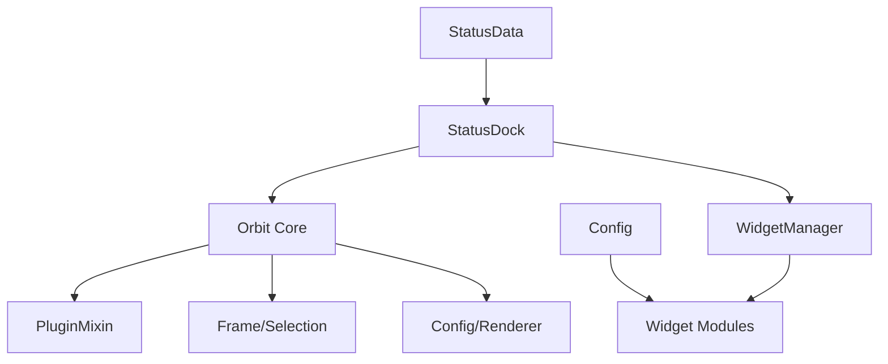

# orbit status

customizable status panel replacing blizzard's status bars. external plugin — depends on orbit core.

## purpose

provides a full-width panel (top or bottom) showing XP, reputation, or honor progress. includes a widget drawer system where users drag widgets into dock slots for quick access to game information.

## files

### Core/

| file | responsibility |
|---|---|
| StatusDock.lua | main plugin. dock frame, edge textures, tooltips, widget zones, blizzard bar hiding. |
| StatusData.lua | data retrieval for XP, reputation, and honor. color definitions, progress calculations. |
| Config.lua | per-character configuration persistence via `Orbit_StatusDB` saved variable. |
| Formatting.lua | number and text formatting utilities (abbreviations, percentages). |
| Graph.lua | spark-graph rendering for widget data visualisation. |

### Widgets/

48 widget modules. each widget is a self-contained data source (gold, durability, quest, reputation, etc.) that can be placed into dock slots via the widget drawer.

## architecture

## orbit core api surface

- `Orbit:RegisterPlugin()` — plugin registration and mixin application
- `Plugin:GetSetting()` / `SetSetting()` — per-layout setting persistence
- `OrbitEngine.Config:Render()` — settings panel rendering from schema
- `OrbitEngine.Frame:AttachSettingsListener()` — edit mode selection and drag
- `OrbitEngine.Frame:RestorePosition()` — saved position restoration
- `OrbitEngine.Pixel:Snap()` — pixel-perfect edge texture sizing
- `Orbit.EventBus` — event subscriptions (edit mode enter/exit)
- `Plugin:RegisterStandardEvents()` — standard lifecycle events

## rules

- this is an external plugin. it depends on orbit core but orbit core must never reference it.
- blizzard status bars must be restored on unload (`OnUnload` → `RestoreBlizzardStatusBars`).
- widget drawer uses its own `Config.lua` persistence separate from orbit's layout system.
- bar type cycling (XP/Rep/Honor) is mouse-wheel driven with auto-detection on login.
- all constants at file top. no magic numbers.
